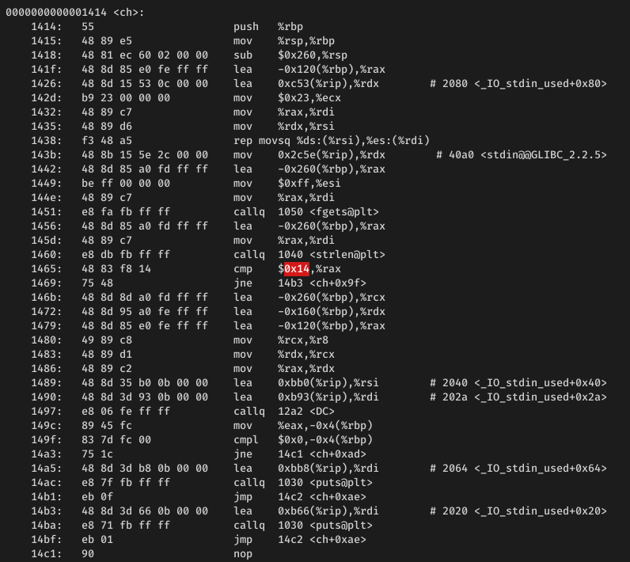

# C-Experiments
[]() []() []()

Experiments on C Exploits

## Environment

- 64 bit Linux Systems

## Completed Challenges

### - Dynamic (c)

- Loads string compare function on runtime
- Self modifies strlen comparison value
- Hides string using bit addition

### - Load (cpp)

- Loads compiled library file on runtime
- Loads string compare function from loaded library
- Hides string using XOR from templates

### - Rewrite (cc)

- Spawns/Clones secondary process for self modification
- Secondary process modifies the heap from /proc/{pid}/mem of primary process
- Hides string using bit addition

### - Corrupt (asm)

- Collapsed ELF header with precompiled statically linked _start function
- Uses truncated input as key, for decoding of flag
- Anti-debugging from corrupted header and invalid executable entry point e_entry

### - Reboot (c)

- Logistic differential equation to "predict" randomized canary values
- 34 byte overflow vulnerable shellcode array stored as reboot shellcode
- Buffer overflow for canary, egghunter shellcode and XOR exploit decoding

## Extras

### - Screwed (c)

- Corrupts ELF 64-bit or 32-bit headers with 0xffff values for e_shoff, e_shnum and e_shstrndx
- Binary is still able to be run normally, but crashes when debugged

### - Prochollow (c)

- Proof of work for Linux process hollowing
- Spawns/Clones secondary process for self modification
- Secondary process modifies the main function from /proc/{pid}/mem of primary process

### - psHide (c)

- Searches process name using directory and pid
- Forces ```ps aux``` to skip process by process name, thus hiding from process list

## Methodology

### - Self Modification

1. MPROTECT and editing of value using C address pointer

    ```shell
    > objdump -d dynamic
    ```

    ### 

    Calculate address of value to overwrite, eg.

    ```C
    void *add = (void*)ch;
    unsigned char *ins = (unsigned char*)add + 84;
    *ins = 0x24;
    ```

    0x14 is overwritten as 0x24

    ```C
    if (strlen(sr)==20) => if (strlen(sr)==36)
    ```

2. Fork processes and editing of value within /proc/{pid}/mem

    Primary process pipes its information (pid, address and length of string to overwrite) to secondary process

    ```C
    int pipe1[2];
    int pipe2[2];
    int pipe3[2];
    pid_t f = fork();
    if (f == 0) {
        close(pipe1[1]);
        close(pipe2[1]);
        close(pipe3[1]);

        read(pipe1[0], addr_buf, 100);
        read(pipe2[0], length_buf, 100);
        read(pipe3[0], pid_buf, 100);
        // ...
    } else {
        close(pipe1[0]);
        close(pipe2[0]);
        close(pipe3[0]);

        // Calculate address, length of string and pid of process

        sprintf(addr_buf, "%lx", addr);
        sprintf(length_buf, "%lu", length);
        sprintf(pid_buf, "%d", pid);

        write(pipe1[1], addr_buf, strlen(addr_buf)+1);
        close(pipe1[1]);
        write(pipe2[1], length_buf, strlen(length_buf)+1);
        close(pipe2[1]);
        write(pipe3[1], pid_buf, strlen(pid_buf)+1);
        close(pipe3[1]);
        //...
    }
    ```

    Secondary process to use pid to read /proc/{pid}/mem and overwrite string at given address and length

    ```C
    strncpy(buf, new_string, *length_given);
    lseek(mem_file, *address, SEEK_SET);
    if (write(mem_file, buf, *length_given) == -1) {
        puts("Incorrect");
        return 1;
    }
    ```

    Temporary string s is overwritten with flag (First string s != Second string s)

    ```C
    printf("\nThe flag is \"%s\"!\n", s);
    puts("\nValidating......");
    sleep(1);
    if (!strcmp(s, inp)) {
        puts("Correct");
    } else {
        puts("Incorrect");
    }
    ```

### - Dynamically loaded functions

1. Load function from struct function list

    ```C
    // Struct to load function
    typedef struct functions{
        const char *function_name;
        TW address;
    } functions;

    // List of dynamic functions
    functions function_struct[] = {
        {"string_compare", &sc},
        {NULL, NULL}
    };

    // Compare called_function with function list, then load and run matched function
    int call_func(const char *called_function, const char* key, long* flag, long* buffer, char* input)
    {
        int k;
        for(k=0; function_struct[k].function_name != NULL; ++k){
            if(strcmp(called_function, function_struct[k].function_name) == 0){
                return function_struct[k].address(key, flag, buffer, input);
            }
        }
        return -1;
    }
    ```

    Calling "string_compare" on call_func() will compare with function list in function_struct, then is loaded and run when matched

    (One function is stored within the struct for simplicity)

2. Load function from self-created library

    ```C
    // Pipe for loaded function
    struct S {
        string input, flag;
        int output;
    };

    static const auto library = "\
        #include<stdlib.h>\n\
        #include<string>\n\
        struct S {std::string a,b;int i;};\n\
        extern \"C\" void F(S &s) {\n\
            if ((s.input.length()==0||\
            s.flag.length()==0)||\
            s.input.compare(s.flag)!=0||\
            s.input.length()!=s.flag.length())\
            {\n\
                s.output=1;\n\
                return;\n\
            }\n\
            s.output=0;}\n\
        ";
    create(library) // Create library using gcc

    void * function_library = load() // Load library
    if ( function_library ) {
        // Load function F from created library
        int ( *func ) ( S & ) = (int (*)( S & )) dlsym ( function_library, "F" );
    }
    ```

    Create its own library with hidden function on runtime, such that loaded function will not be shown during decompilation

### - Corrupted header

1. Collapse header via assembly

    ### 

    Entrypoint of executable is fit into the Magic bytes in the ELF header, on top of the collapsed headers

    Entrypoint gives problems to static debuggers and disassemblers from disassembling the full binary

    Radare2 and other dynamic disassemblers are able to ignore the ELF header and follow the jump instruction after the entrypoint, thus able to disassemble much more of the executable

2. Corrupt ELF headers, i.e. `e_shoff, e_shnum and e_shstrndx`

    ```C
    static Elf64_Ehdr* header;

    header->e_shoff = 0xffff;
    header->e_shnum = 0xffff;
    header->e_shstrndx = 0xffff;
    ```

    Disassembler reads ELF binary with overflow, preventing static debuggers and disassemblers from working

    Values can be also be changed to 0x0 for the opposite effect, where the disassembler is unable to read the full binary
