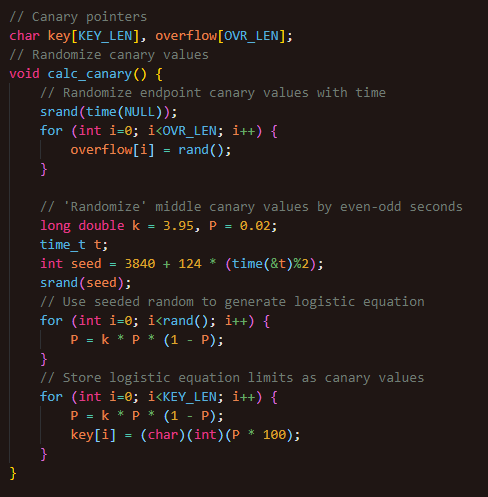
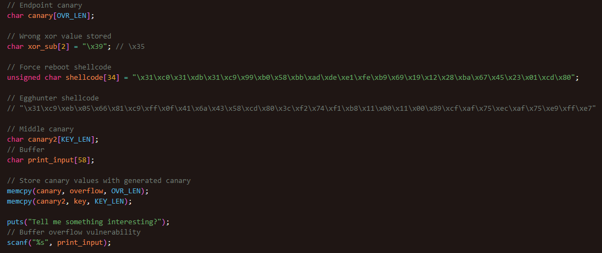
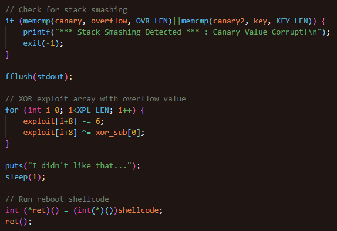

# Dynamic

## Solving

- TBC

## Workflow

- Initialization of buffer overflow canary

- Use time-randomized seed for endpoint canary to prevent excess unintended buffer overflow

- Use logistics differential model to predict periodic variations of the growth limit

  - As such, the randomized middle canary is predictable

### 

- Buffer overflow exploitable array structure

  1. Input buffer (58 bytes)

  2. Middle canary (6 bytes)

  3. Shellcode (34 bytes)

  4. XOR value (2 bytes) -> extra byte for newline char

  5. End canary (100 bytes)

- Use scanf for buffer overflow vulnerability

### 

- Checks for changed canary values, then exits if modified

- Initialize exploit array by XOR (overflow) and SUB ('\x06')

- Run overflow vulnerable shellcode array (Reboots if not modified)

### 

- Corrupted headers for anti-debugging

- Edited ELF program header table to include egg pattern, preventing egghunter from finding the hidden shellcode when run
